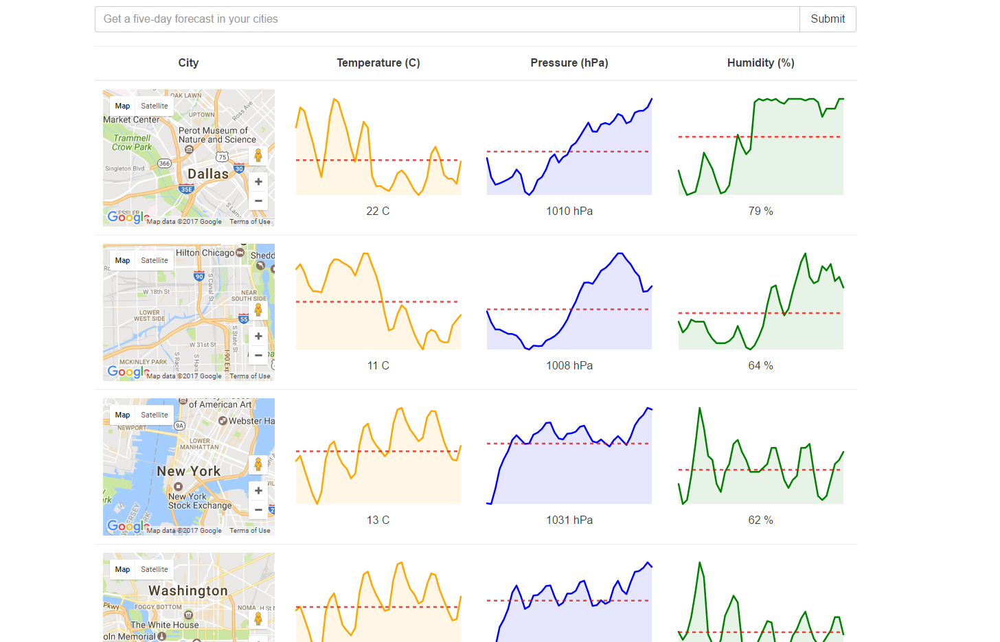

<<<<<<< HEAD
####How To Use#####
Checkout this repo, install dependencies, then start the gulp process with the following:

```
	> npm install
	> npm start
```
open http://localhost:8090/


####Screenshot####



=======
# Search-Forecast-by-City
React&amp;Redux project using Middleware, Google API &amp; Spark-lines library
>>>>>>> 383efe81456b3bf9f25249df3af0f4b1ad482acd
